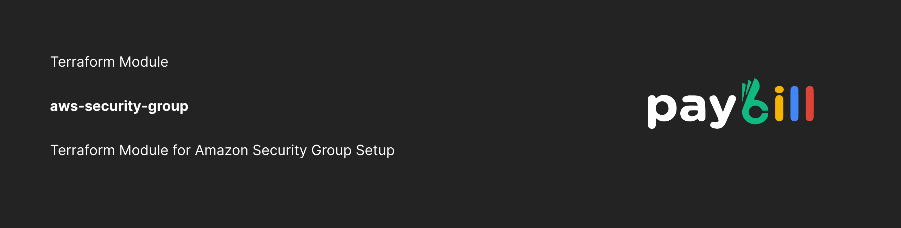

  <a href="https://paybill.dev" target="_blank">
    <picture>
      
    </picture>
  </a>

# Terraform Module: Security Group  

## Overview

This Terraform module creates an AWS Security Group with fully customizable ingress and egress rules. It supports CIDR-based, IPv6, and security-group-based access rules using dynamic blocks, includes tagging, and outputs the security group ID.

<!-- BEGIN_TF_DOCS -->
## Requirements

No requirements.

## Providers

| Name | Version |
|------|---------|
|  [aws](#provider\_aws) | n/a |

## Modules

No modules.

## Resources

| Name | Type |
|------|------|
| [aws_security_group.sg](https://registry.terraform.io/providers/hashicorp/aws/latest/docs/resources/security_group) | resource |

## Inputs

| Name | Description | Type | Default | Required |
|------|-------------|------|---------|:--------:|
|  [egress\_rules](#input\_egress\_rules) | Egress rules for the security groups. | <pre>map(object({     description       = optional(string)     from_port         = number     to_port           = number     protocol          = string     cidr_blocks       = optional(list(string))     security_group_id = optional(list(string))     ipv6_cidr_blocks  = optional(list(string))   }))</pre> | `{}` | no |
|  [ingress\_rules](#input\_ingress\_rules) | Ingress rules for the security groups. | <pre>map(object({     description       = optional(string)     from_port         = number     to_port           = number     protocol          = string     cidr_blocks       = optional(list(string))     security_group_id = optional(list(string))     ipv6_cidr_blocks  = optional(list(string))     self              = optional(bool)   }))</pre> | `{}` | no |
|  [security\_group\_description](#input\_security\_group\_description) | Description of the security groups | `string` | `"my-security-group"` | no |
|  [security\_group\_name](#input\_security\_group\_name) | Prefix for the name of the security groups. | `string` | `"my-security-group"` | no |
|  [tags](#input\_tags) | Tags to assign the security groups. | `map(string)` | n/a | yes |
|  [vpc\_id](#input\_vpc\_id) | ID of the VPC to create the security groups in. | `string` | n/a | yes |

## Outputs

| Name | Description |
|------|-------------|
|  [id](#output\_id) | The ID of the security group |
<!-- END_TF_DOCS -->